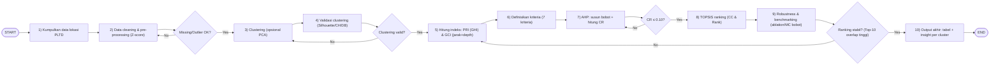

```mermaid
flowchart LR;
A([START]) --> B["1) Kumpulkan data lokasi PLTD"];
B --> C["2) Data cleaning & pre-processing (Z-score)"];
C --> D{"Missing/Outlier OK?"};

D -- Yes --> E["3) Clustering (opsional PCA)"];
D -- No --> C;

E --> F["4) Validasi clustering (Silhouette/CH/DB)"];
F --> G{"Clustering valid?"};

G -- Yes --> H["5) Hitung indeks: PRI (GHI) & GCI (jarak+depth)"];
G -- No --> E;

H --> I["6) Definisikan kriteria (7 kriteria)"];
I --> J["7) AHP: susun bobot + hitung CR"];
J --> K{"CR ≤ 0.10?"};

K -- Yes --> L["8) TOPSIS ranking (CC & Rank)"];
K -- No --> J;

L --> M["9) Robustness & benchmarking (ablation/MC bobot)"];
M --> N{"Ranking stabil? (Top-10 overlap tinggi)"};

N -- Yes --> O["10) Output akhir: tabel + insight per cluster"];
N -- No --> H;

O --> P([END]);
```
