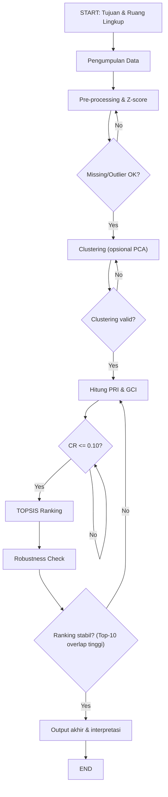

```mermaid
flowchart TD;
A["START: Tujuan & Ruang Lingkup"] --> B["Pengumpulan Data"];
B --> C["Pre-processing & Z-score"];
C --> D{"Missing/Outlier OK?"};
D -- Yes --> E["Clustering (opsional PCA)"];
D -- No --> C;
E --> F{"Clustering valid?"};
F -- Yes --> G["Hitung PRI & GCI"];
F -- No --> E;
G --> H{"CR <= 0.10?"};
H -- Yes --> I["TOPSIS Ranking"];
H -- No --> H;
I --> J["Robustness Check"];
J --> K{"Ranking stabil? (Top-10 overlap tinggi)"};
K -- Yes --> L["Output akhir & interpretasi"];
K -- No --> G;
L --> M["END"];
```
